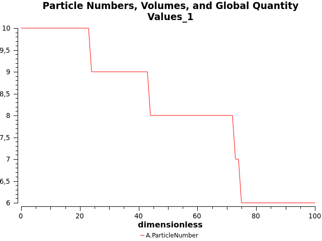

# Question 1

* 10
  * Temps: 00.02 secondes  
  

* 1000
  * Temps: 00.15 secondes  
  

* 100000
  * Temps: 35.90 secondes  
  

* 1000000
  * Temps : 8:06.73 minutes
  

# Question 2

* A(0) = 10
  * *t** = 7
* A(0) = 1000
  * *t** = 8
* A(0) = 100000
  * *t** = 8
* A(0) = 1000000
  * *t** = 7

Ainsi, *t* ne varie pas pour des réactions dont le nombre de molécules varie.
*t* est ainsi **constant** en nombre de molécules.

# Question 3

Le temps de calcul est **exponentiel**. Ainsi, il serai comparable au nombre de molécules d'*H2O* présents dans 1L d'eau.

# Question 4

Pour un nombre de molécules de 10⁵, voici une trace de la courbe.  

* k = 0.001  
  

* k = 0.002  
  

Nous remarquons que nous pouvons diviser par 2 le temps mis en oeuvre afin de d'arriver à A(0)/2, en multipliant la vitesse par 2.  
Ainsi, **la vitesse de réaction influe directement sur l'obtention du temps de "demi-vie de la réaction"**

# Question 5

* E = 10  
  

* E = 1  
  

* E = 0  
  

Pour la dernière figure, le nombre de molécules pour les espèces *E* et *P* sont à 0.

# Question 6

Voici les temps associés aux simulations:

* 10
  * Temps: 00.01 seconde (**meilleur**)  
* 1000
  * Temps: 00.02 secondes (**meilleur**)
* 100000
  * Temps: 00.03 secondes (**meilleur**)
* 1000000
  * Temps : 00.17 secondes (**meilleur**)

Ainsi, COPASI détient une meilleure implémentation que le programme Python écrit.

# Question 7

Oui, il y a toujours une concordance avec *t* = 7.

# Question 8

Non plus, car le temps sera toujours exponentiel.  
Par contre, ce sera toujours mieux que d'utiliser mon programme Python...

# Question 9

Voici les comparaisons concernant les courbes entre la question 6 et la question 9:

* 10  
    
  

* 1000  
    
  

* 100000  
    
  

* 10000000  
    
  

* 10000000  
    
  

On voit ainsi que la réaction a tendance a allé moins vite vers le 0 que pour la méthode directe.  
La différence entre les 2 méthodes est que le **tau-leaping** est une approximation de la méthode directe de Gillespie, prenant en compte des intervalles de temps plus grands que ceux calculés avec la méthode exacte, car approximé. Cela permet ainsi de consommer moins de temps à calculer les *tau*, et donc d'économiser du temps de calcul.

# Question 10

* k = 0.001  
  

* k = 0.002  
  

On pourra remarquer que, par rapport aux figures effectués dans l'exercice 4, les temps de demi-vie sont divisés par 2.  
Ainsi, le temps de demi-vie de la réaction avec k=0.001 est égal à celui de la réaction à k=0.002 pour l'exercice 4; et le temps de demi-vie de la réaction avec k=0.002 est égal à celui de la réaction à k=0.002, divisé par 2.

# Question 11

* k = 0.001  
  

* k = 0.002  
  

La différence entre cette simulation stochastique et celle effectuée avec ma propre implémentation est justement celle retrouvée avec la simulation effectuée en **question 10**.

# Question 12

Le nombre de molécules de X et Y va rester stable dans le temps, avec les 3 vitesses égales.  
Par contre, si k_repr est supérieure aux 2 autres, il y aura une augmentation constante de X au court du temps. Y sera toujours au même point.  
Si k_chas est supérieure aux 2 autres, il y aura une augmentation constante de Y au court du temps. X sera toujours au même point.  
Au contraire, si k_mour est supérieure aux 2 autres, Y va tendre vers 0, et il n'y aura plus qu'une augmentation constante de X au cours du temps.

# Question 13

Voici une capture de la simulation:

Nous voyons une grande variation du nombre des particules concernant les espèces X et Y.  
Cette grande variation n'est pas reconnue dans les comportements décrits dans la précédente question.

# Question 14

Voici une capture de la simulation:

Un orbite correspond à un cycle de vie Proie/Prédateur.  
Il monte (montée de X, la proie), il est stable et la quantité des proies diminue (montée de Y, les prédateurs), et revient vers l'état initial car il n'y a presque plus de proies, et les prédateurs commencent à mourir.

# Question 15

On retrouve 2 choses:
* soit les prédateurs meurent et les proies prennent le pouvoir,
* soit il y a un cycle jusqu'à ce que les proies meurent, et donc les prédateurs meurent à la suite, étant donné qu'ils ne peuvent plus rien "manger".

# Question 16

L'écosystème est, principalement, stable. Ainsi, il serai préférable de tendre vers une simulation déterministe pour ce système (Proie/Prédateur), et non pas stochastique qui tend vers un environnement chaotique.  
Quant au système proposé dans la Q3, il serai beaucoup plus préférable d'utiliser une simulation déterministe, étant donné que la simulation stochastique prendra bien plus de temps de calcul.
