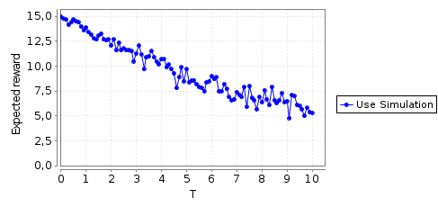

# Rapport PRISM

## Auteur

Carette Antonin

### Question 1

D'après PRISM, le modèle chargé contient 2 états.

### Question 2

```
Exporting list of reachable states in plain text format below:
(X_,Y_)
0:(0,1)
1:(1,0)
```

### Question 3

```
Exporting transition matrix in plain text format below:
2 2
0 1 1.5
1 0 0.5
```

### Question 4

<center>

</center>

### Question 5

Voici le contenu du fichier
```
action step X_ Y_
- 0 1 0
[switchOFF] 1 0 1
[switchON] 2 1 0
[switchOFF] 3 0 1
[switchON] 4 1 0
[switchOFF] 5 0 1
[switchON] 6 1 0
[switchOFF] 7 0 1
[switchON] 8 1 0
[switchOFF] 9 0 1
[switchON] 10 1 0
[switchOFF] 11 0 1
[switchON] 12 1 0
[switchOFF] 13 0 1
[switchON] 14 1 0
[switchOFF] 15 0 1
```

### Question 6

Le graphique généré est visible ci-dessous:  
<center>

</center>

### Question 7

Voici le code associé à la réponse concernant cette question:  
```
// model type
ctmc

// constants
const double k_deg = 0.1;

module deg

	A_ : [0..100] init 15;

	[transition] (A_ > 0) -> (k_deg * A_): (A_' = A_ - 1);

endmodule
```

### Question 8

États atteignables:  
```
Exporting list of reachable states in plain text format below:
(A_)
0:(0)
1:(1)
2:(2)
3:(3)
4:(4)
5:(5)
6:(6)
7:(7)
8:(8)
9:(9)
10:(10)
11:(11)
12:(12)
13:(13)
14:(14)
15:(15)
```

Matrice de transition:  
```
Exporting transition matrix in plain text format below:
16 16
0 0 1
1 0 0.1
2 1 0.2
3 2 0.3
4 3 0.4
5 4 0.5
6 5 0.6
7 6 0.7
8 7 0.8
9 8 0.9
10 9 1
11 10 1.1
12 11 1.2
13 12 1.3
14 13 1.4
15 14 1.5
```

### Question 9

Question facultative passée...

### Question 10

Voici le code importé:  
```
// File generated by automatic SBML-to-PRISM conversion
// Original SBML file: sortie_prism.prism.tmp.xml

ctmc

const int MAX_AMOUNT = 100;

// Compartment size
const double compartment = 1.0;

// Parameters for reaction R1
const double k1 = 0.1; // k1

// Species A (A)
const int _A_MAX = MAX_AMOUNT;
module _A

	_A : [0.._A_MAX] init 100; // Initial amount 100

	// R1 (R1)
	[R1] _A > 0 -> (_A'=_A-1);

endmodule

// Reaction rates
module reaction_rates

	// R1 (R1): A ->
	[R1] (compartment*k1*_A) > 0 -> (compartment*k1*_A) : true;

endmodule

// Reward structures (one per species)

// Reward 1: A (A)
rewards "_A" true : _A; endrewards
```

Il n'y a aucune différence entre les 2.

### Question 11

Ici encore, il n'y a aucune différence entre les 2 simulations:  
```
Exporting list of reachable states in plain text format below:
(_A)
0:(0)
1:(1)
2:(2)
3:(3)
4:(4)
5:(5)
6:(6)
7:(7)
8:(8)
9:(9)
10:(10)
11:(11)
12:(12)
13:(13)
14:(14)
15:(15)
```

```
Exporting transition matrix in plain text format below:
16 16
0 0 1
1 0 0.1
2 1 0.2
3 2 0.3
4 3 0.4
5 4 0.5
6 5 0.6
7 6 0.7
8 7 0.8
9 8 0.9
10 9 1
11 10 1.1
12 11 1.2
13 12 1.3
14 13 1.4
15 14 1.5
```

### Question 12

Voici la courbe attendue:  
<center>

</center>

### Question 13

Voici la courbe attendue:  
<center>

</center>

### Question 14

Question facultative passée...

### Introduction aux questions 15 et 16

Voici le modèle généré:  
```
// File generated by automatic SBML-to-PRISM conversion
// Original SBML file: copa_cycle.prism.tmp.xml

ctmc

const int MAX_AMOUNT = 100;

// Compartment size
const double compartment = 1.0;

// Parameters for reaction R1
const double k1 = 0.1; // k1

// Parameters for reaction R2
const double k1_2 = 0.1; // k1

// Parameters for reaction R3
const double k1_3 = 0.1; // k1

// Species A (A)
const int _A_MAX = MAX_AMOUNT;
module _A

	_A : [0.._A_MAX] init 50; // Initial amount 50

	// R1 (R1)
	[R1] _A > 0 -> (_A'=_A-1);
	// R3 (R3)
	[R3] _A > 0 & _A <= _A_MAX-1 -> (_A'=_A+1);

endmodule

// Species B (B)
const int B_MAX = MAX_AMOUNT;
module B

	B : [0..B_MAX] init 50; // Initial amount 50

	// R1 (R1)
	[R1] B > 0 & B <= B_MAX-1 -> (B'=B+1);
	// R2 (R2)
	[R2] B > 0 -> (B'=B-1);

endmodule

// Species C (C)
const int _C_MAX = MAX_AMOUNT;
module _C

	_C : [0.._C_MAX] init 50; // Initial amount 50

	// R2 (R2)
	[R2] _C > 0 & _C <= _C_MAX-1 -> (_C'=_C+1);
	// R3 (R3)
	[R3] _C > 0 -> (_C'=_C-1);

endmodule

// Reaction rates
module reaction_rates

	// R1 (R1): A+B -> B
	[R1] (compartment*k1*_A*B) > 0 -> (compartment*k1*_A*B) : true;
	// R2 (R2): B+C -> C
	[R2] (compartment*k1_2*B*_C) > 0 -> (compartment*k1_2*B*_C) : true;
	// R3 (R3): C+A -> A
	[R3] (compartment*k1_3*_C*_A) > 0 -> (compartment*k1_3*_C*_A) : true;

endmodule

// Reward structures (one per species)

// Reward 1: A (A)
rewards "_A" true : _A; endrewards
// Reward 2: B (B)
rewards "B" true : B; endrewards
// Reward 3: C (C)
rewards "_C" true : _C; endrewards
```

### Question 15

Voici la courbe attendue:  
<center>

</center>

### Question 16

Voici la courbe attendue:  
<center>

</center>
